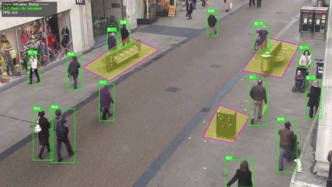

**English** | [简体中文](README_zh.md)

# Crowd Abnormal Behavior Detection

[](LICENSE)
[](https://www.python.org/)
[](https://github.com/ultralytics/ultralytics)
[](https://github.com/juzishazhou/crowd-abnormal-behavior-detection)
[](https://github.com/juzishazhou/crowd-abnormal-behavior-detection/commits/main)
[](https://github.com/juzishazhou/crowd-abnormal-behavior-detection)

> Real-time human abnormal behavior detection in crowded scenes — powered by Ultralytics YOLO and ByteTrack.

A graduation project that detects three categories of human abnormal behavior from video streams:

- **Fall Detection** — pose estimation + ByteTrack tracking + trajectory analysis + temporal smoothing
- **Running Detection** — object detection + ByteTrack tracking + pixel-velocity thresholding
- **Intrusion Detection** — polygon zone configuration + foot-center / trajectory judgment

---

## Features

### 🧠 Fall Detection
Detects human falls using YOLOv8-pose for keypoint extraction, ByteTrack for multi-object tracking, and trajectory-based temporal analysis with smoothing to suppress false positives.

### 🏃 Running Detection
Identifies individuals moving at abnormally high speeds using YOLO object detection combined with ByteTrack tracking and pixel-velocity computation against a configurable threshold.

### 🚫 Intrusion Detection
Monitors user-defined polygonal forbidden zones and triggers alerts when a person's foot center or trajectory enters the restricted area. Supports interactive zone calibration via `tools/zone_selector.py`.

---

## Demo

### Fall Detection


### Running Detection


### Intrusion Detection


---

## Quick Start

```bash
git clone https://github.com/juzishazhou/crowd-abnormal-behavior-detection.git
cd crowd-abnormal-behavior-detection
pip install -r requirements.txt
python scripts/fall_detection.py --source assets/fall.mp4 --output outputs/fall_demo.mp4
```

Sample videos are provided in `assets/`. Weights are downloaded automatically on first run.

Try all three detectors with the sample videos:

```bash
# Fall detection
python scripts/fall_detection.py --source assets/fall.mp4 --output outputs/fall_demo.mp4

# Running detection
python scripts/running_detection.py --source assets/running.mp4 --output outputs/running_demo.mp4

# Intrusion detection (with built-in example zone)
python scripts/intrusion_detection.py --source assets/intrusion.mp4 --output outputs/intrusion_demo.mp4
```

---

## Project Structure

```
crowd-abnormal-behavior-detection/
├── README.md
├── README_zh.md
├── LICENSE
├── requirements.txt
├── .gitignore
├── CITATION.cff
├── _common.py                       # Shared utilities (video I/O, keyframe extraction, etc.)
├── scripts/                         # Core detection scripts
│   ├── fall_detection.py            # Fall detection
│   ├── running_detection.py         # Running detection
│   └── intrusion_detection.py       # Forbidden zone intrusion detection
├── configs/                         # Configuration files
│   ├── bytetrack_fall.yaml          # ByteTrack config for fall detection
│   ├── bytetrack.yaml               # ByteTrack config for running detection
│   └── forbidden_zone.example.json  # Example forbidden zone polygon
├── tools/                           # Utility tools
│   ├── check_env.py                 # Environment checker
│   ├── zone_selector.py             # Interactive zone calibration
│   ├── export_alerts.py             # Alert export to JSON
│   ├── frame_viewer.py              # Frame-by-frame video viewer
│   ├── measure_fps.py               # FPS benchmark
│   ├── measure_pipeline.py          # Pipeline latency benchmark
│   ├── measure_tracking.py          # Tracking performance benchmark
│   └── run_eval.py                  # Model evaluation
├── docs/                            # Documentation
│   ├── USAGE.md                     # Detailed usage guide
│   ├── test_report.md               # Environment verification report
│   └── refactor_report.md           # Code quality refactoring report
├── assets/                          # Static assets
│   ├── fall.mp4                     # Fall detection sample video
│   ├── running.mp4                  # Running detection sample video
│   ├── intrusion.mp4                # Intrusion detection sample video
│   └── demo/                        # Demo GIFs for README
│       ├── fall_demo.gif
│       ├── running_demo.gif
│       └── intrusion_demo.gif
└── outputs/                         # Local outputs (gitignored)
    └── .gitkeep                     # Placeholder to keep directory visible
```

---

## Installation

**Python**: 3.8 or later recommended.

```bash
git clone https://github.com/juzishazhou/crowd-abnormal-behavior-detection.git
cd crowd-abnormal-behavior-detection
pip install -r requirements.txt
```

### Dependencies

| Package | Purpose |
|---|---|
| `ultralytics>=8.4.65` | YOLO inference + tracking |
| `opencv-python>=4.13.0` | Video I/O + visualization |
| `numpy>=2.4.4` | Numerical operations |
| `torch>=2.12.0` | PyTorch backend |
| `shapely>=2.1.2` | Precise polygon ops (optional; intrusion detection has fallback) |
| `psutil>=7.2.2` | System info checks |
| `matplotlib>=3.10.9` | Figure plotting |

---

## Weights

**This repository does not include `.pt` weight files.**

### Official Pre-trained Weights

After `pip install ultralytics`, weights (e.g., `yolov8n.pt`, `yolov8n-pose.pt`, `yolov8s.pt`) are downloaded automatically from Ultralytics servers on first run.

You may also manually place them under `weights/` (this directory is gitignored):

```bash
mkdir weights
# Download from https://github.com/ultralytics/assets/releases
```

### Fine-tuned Weights

Weights fine-tuned on the WiderPerson dataset are large (~225 MB) and not included in this repo.

> **TODO**: Provide download links via GitHub Releases.

---

## Usage

All scripts are run from the project root.

### Fall Detection

```bash
python scripts/fall_detection.py --source <video_path> --output outputs/fall_demo.mp4
```

- Model: auto-uses `weights/yolov8n-pose.pt` (pose estimation)
- Tracker: `configs/bytetrack_fall.yaml`
- Optional: `--extract-keyframes` to extract fall keyframes

### Running Detection

```bash
python scripts/running_detection.py --source <video_path> --output outputs/running_demo.mp4
```

- Model: auto-uses `weights/yolov8s.pt` (object detection)
- Tracker: `configs/bytetrack.yaml`
- Logs: `outputs/running_events.json` (JSON event log with confidence scores)
- Sensitivity: `--conf-trigger 0.40` (lower = more detections, higher = fewer false positives)
- Quick test: `python scripts/running_detection.py --source assets/running.mp4`

### Forbidden Zone Intrusion Detection

Two-step workflow:

```bash
# Step 1: Interactive zone calibration
python tools/zone_selector.py --source <video_path> --output configs/forbidden_zone.json

# Step 2: Run detection
python scripts/intrusion_detection.py --source <video_path> --zone configs/forbidden_zone.json --output outputs/intrusion_demo.mp4
```

If `--zone` is omitted, a built-in example polygon (suitable for 1280×720 center area) is used.

See [docs/USAGE.md](docs/USAGE.md) for full parameter details.

---

## Performance

Benchmark results measured on a laptop with NVIDIA GeForce RTX 3050 (4 GB), CUDA 12.6, PyTorch 2.12.0:

| Test | Resolution | FPS | Model |
|------|-----------|-----|-------|
| Detection-only (fall video) | 720×1280 | **26.6** | YOLOv8n-pose |
| Full pipeline (running video) | 632×480 | **71.5** | YOLOv8s |

Benchmark tools: `tools/measure_fps.py` and `tools/measure_pipeline.py`.

---

## Utility Tools

| Tool | Command | Purpose |
|------|---------|---------|
| Env Check | `python tools/check_env.py` | Check Python / PyTorch / Ultralytics versions |
| Zone Selector | `python tools/zone_selector.py --source <video> --output configs/zone.json` | Interactive forbidden zone calibration |
| Alert Export | `python tools/export_alerts.py --video <video>` | Batch export alerts as JSON |
| Frame Viewer | `python tools/frame_viewer.py <video_path>` | Step through video frame by frame |
| FPS Benchmark | `python tools/measure_fps.py --video <video> --weights <weights.pt>` | Measure detection-only FPS |
| Pipeline Latency | `python tools/measure_pipeline.py --video <video> --weights <weights.pt>` | Measure per-stage latency |
| Tracking Benchmark | `python tools/measure_tracking.py --video <video> --weights <weights.pt>` | Measure tracking metrics |
| Model Eval | `python tools/run_eval.py --weights <model.pt> --data <dataset.yaml>` | Evaluate mAP / PR curves |

> **Note**: `run_eval.py`, `export_alerts.py`, and `measure_*.py` are optional advanced tools that require trained weights or datasets.

---

## Notes

1. **Not included**: datasets, weight files (.pt), training results
2. Sample videos for quick testing are already provided in `assets/`. Use them via `--source assets/fall.mp4` etc.
3. Provide your own input videos via `--source` when testing with custom footage
4. Forbidden zone coordinates should be calibrated via `tools/zone_selector.py` for your specific video resolution
5. Place weight files in `weights/` to use them (this directory is gitignored)

---

## License

This project is open-sourced under [AGPL-3.0](LICENSE).

Built on [Ultralytics YOLO](https://github.com/ultralytics/ultralytics) (AGPL-3.0), and carries forward its license.

```
Copyright (C) 2026 juzishazhou
```

---

## Acknowledgements

- [Ultralytics YOLO](https://github.com/ultralytics/ultralytics) — State-of-the-art object detection framework
- [ByteTrack](https://github.com/ifzhang/ByteTrack) — Multi-object tracking algorithm
- [WiderPerson](https://github.com/ShiqiYu/WiderPerson) — Dense pedestrian detection dataset
